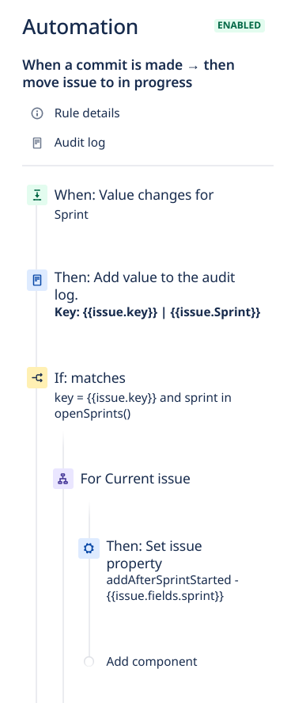

# jira-reports-csv

This project automates the generation of reports in `.csv` format using the JIRA API.

The modules are designed to create reports for the following categories:

- __Planned__: Issues added before the sprint begins.
- __Unplanned__: Issues added after the sprint has started (during live running sprints).

The main objective of this project is to extend the analysis possibilities of sprint performance without depending on the limited visualization plugins available in Jira Dashboards.

## Project Structure

```bash
├── 00-jira-filter-setup        # setup JQL filters to detect issues planned and unplanned
│   └── ...
├── 01-extract                  # generate reports in raw Jira API format (json)
│   └── ...
├── 02-transform                # process the raw report and create a CSV final report
│   └── ...
└── config
    ├── settings.yaml.example   # module settings (example file)
    └── .secrets.yaml.example   # jira API credentials (example file)
```

## Requirements - Jira Automation to Detect Issues Add After Sprint Started

Jira does not have a native way to filter issues added after a sprint has started. To address this limitation, a workaround is required: creating a Jira Automation rule that adds a comment to an issue whenever it is created or placed in an active sprint. This comment should contain the sprint ID, which will serve as a source for filtering unplanned issues based on their origin.

> [!NOTE]
>
> There is a long time opened Issue in the Jira Project for this filter implementation.
>
> More Details: https://jira.atlassian.com/browse/JRACLOUD-75868

The following image depicts the automation that needs to be created.



## 00-jira-filter-setup - Setup Jira Filters

This module creates a Jira filter to list the planned, unplanned, and all issues in a sprint.

It utilizes the Jira Automation described in the previous section.

## 01-extract - Extract Issues in Raw Format

This module executes a JQL query in the Jira API using the filters created in the previous step. It then creates a `.json` file containing issues related to the sprint categorized as planned and unplanned.

## 02-transform - Extract Issues in Raw Format

This module processes the `.json` report generated by the `01-extract` module and creates a high-level `.csv` report with a limited scope of fields.

This `.csv` is intended for use in spreadsheet engines to build graphs and conduct analyses according to team needs.

CSV fields:

- _area_
- _assignee_email_
- _assignee_name_
- _epic_link_summary_
- _is_planned_
- _issue_key_
- _issue_type_
- _priority_
- _sprint_
- _sprint_count_
- _status_
- _status_category_
- _summary_
- _team_
- _time_original_estimate_
- _time_spent_

## How to Run

1. Clone the project:

```bash
$ git clone https://github.com/c-neto/jira-csv-reports
```

---

2. Configure the module settings:

- Create the settings file: `jira-csv-reports/config/settings.yaml` (refer to [config/settings.yaml.example](config/settings.yaml.example))
- Create the secrets file: `jira-csv-reports/config/.secrets.yaml` (refer to [config/.secrets.yaml.example](config/.secrets.yaml.example))

> [!NOTE]
>
> Create new files based on the contents of the files with the `.example` suffix in their respective folders.

---

3. Create a virtual environment and install the dependencies:

```bash
$ make setup
```

---

4. Set up the JQL filters:

```bash
$ make jira-filter-setup
```

---

5. Generate the Raw Report (JSON file with issues in Jira API format containing all metadata):

```bash
$ make extract
```

---

6. Generate the Processed Report (CSV report with limited fields):

```bash
$ make transform
```
